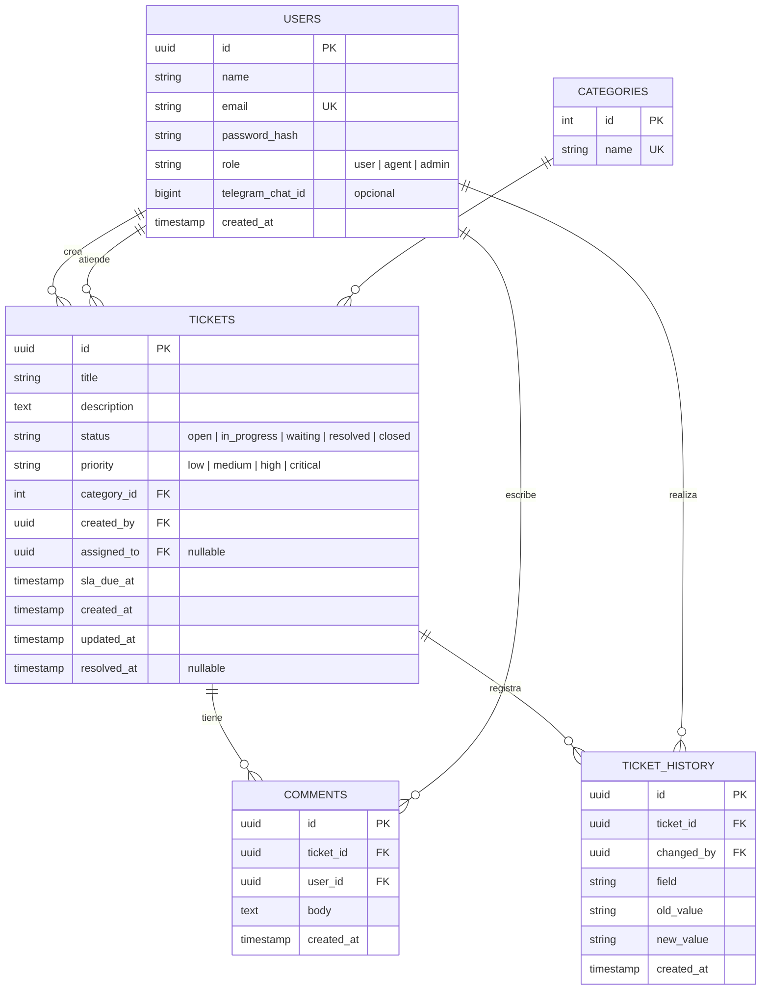

# Diagrama entidad-relación

```mermaid
erDiagram
    USERS ||--o{ TICKETS : "crea"
    USERS ||--o{ TICKETS : "atiende"
    CATEGORIES ||--o{ TICKETS : "clasifica"
    TICKETS ||--o{ COMMENTS : "tiene"
    TICKETS ||--o{ TICKET_HISTORY : "registra"
    USERS ||--o{ COMMENTS : "escribe"
    USERS ||--o{ TICKET_HISTORY : "realiza"

    USERS {
        uuid id PK
        string name
        string email UK
        string password_hash
        string role "user | agent | admin"
        bigint telegram_chat_id "opcional"
        timestamp created_at
    }
    CATEGORIES {
        int id PK
        string name UK
    }
    TICKETS {
        uuid id PK
        string title
        text description
        string status "open | in_progress | waiting | resolved | closed"
        string priority "low | medium | high | critical"
        int category_id FK
        uuid created_by FK
        uuid assigned_to FK "nullable"
        timestamp sla_due_at
        timestamp created_at
        timestamp updated_at
        timestamp resolved_at "nullable"
    }
    COMMENTS {
        uuid id PK
        uuid ticket_id FK
        uuid user_id FK
        text body
        timestamp created_at
    }
    TICKET_HISTORY {
        uuid id PK
        uuid ticket_id FK
        uuid changed_by FK
        string field
        string old_value
        string new_value
        timestamp created_at
    }
```